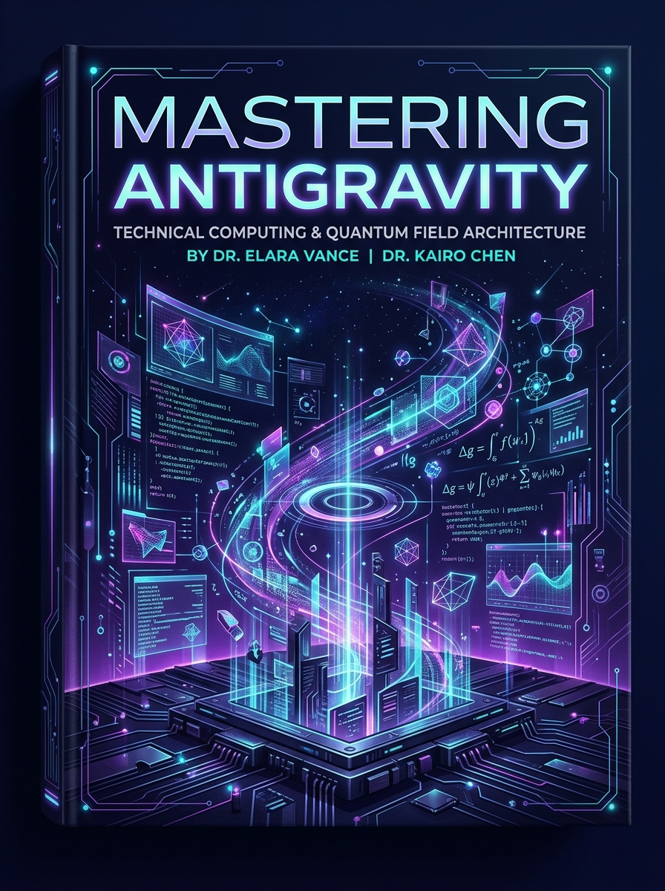

# Mastering Antigravity: The Definitive Guide to AI-First Software Engineering

**Author**: Sudheer K. Mohammed  
**Published**: 2026  
**License**: MIT / Creative Commons  



---

## 📖 Overview

**Google Antigravity (AGY)** is an AI-first software engineering ecosystem where autonomous agents act as true peer engineers. This repository contains the complete book manuscript, typeset editions, and runnable integration suite.

### Available Formats
* 📕 **[Download PDF](mastering_antigravity.pdf)**: 50-page comprehensive typeset volume with custom callouts, diagrams, and code listings.
* 📱 **[Download EPUB](mastering_antigravity.epub)**: E-reader compatible edition with embedded cover art and responsive styling.

---

## 📚 Table of Contents

### Part I: The Ground Floor (Beginner)
* **Chapter 1: The AI-First Awakening** – Beyond the digital typewriter; the Plan-Act-Observe loop.
* **Chapter 2: First Contact: Setup, CLI & Configuration** – Installation, OAuth device authentication, workspace scoping.
* **Chapter 3: The Three Faces of Antigravity** – Antigravity IDE (Tab autocomplete, Inline `Ctrl+I`, Sidebar Agent), Desktop 2.0 Canvas, and CLI TUI.

### Part II: Core Agentic Workflows & Pair Programming (Intermediate)
* **Chapter 4: The Art of Planning, Goal Architecture & Review Loops** – The ATDG (Acceptance Test-Driven Goal) framework, `/grill-me`, `/goal`.
* **Chapter 5: Precision Context Engineering & Battle-Tested Prompts** – Token economics, `@` mentions, Zero-Regression Refactoring, Forensic Bug Triage.
* **Chapter 6: The Iron Sandbox: Security & Permissions** – Execution policies (`strict`, `request-review`, `proceed-in-sandbox`), path containment.

### Part III: The Customization Engine (Advanced)
* **Chapter 7: Rules of the Realm: Hierarchical Governance** – `GEMINI.md`, `AGENTS.md`, upward directory walking, and trigger modes.
* **Chapter 8: Crafting Skills with Progressive Disclosure** – Anatomy of `SKILL.md`, YAML frontmatter registration, runtime activation.
* **Chapter 9: Deterministic Gates with Hooks** – `hooks.json`, blocking pre-tool guards in Python, and post-tool formatters.
* **Chapter 10: Model Context Protocol (MCP) Integration** – Connecting external databases and GitHub tools, eager vs. lazy tool loading.

### Part IV: Programmatic Agent Mastery & The Skill Stack (Expert)
* **Chapter 11: The Antigravity Python SDK** – Headless orchestration with `google-antigravity`, streaming thoughts, asynchronous SRE bots.
* **Chapter 12: Swarms, Browser Agents & Daemons** – Subagent delegation, headless browser automation with WebP recording, cron schedules.
* **Chapter 13: Enterprise Monorepos & CI/CD** – Domain-partitioned rule architecture, automated GitHub Actions PR review bot.
* **Chapter 14: The AI Developer's Skill Stack: Thriving in the Agentic Era** – The 6 pillars of modern AI software engineering.
* **Chapter 15: Interfacing Antigravity: WhatsApp, Telegram & Google Workspace** – Omnichannel gateways, real-time thought streaming, Google Sheets audit ledgers.

### Appendices
* **Appendix A**: Slash Command Quick Reference (`/help`, `/goal`, `/grill-me`, `/learn`, `/schedule`, `/clear`)
* **Appendix B**: Customization Directory Reference (`.agents/`, `~/.gemini/config/`)
* **Appendix C**: Keyboard Shortcuts Cheat Sheet
* **Appendix D**: Production Prompt & Goal Cookbook

---

## 🛠️ Runnable Integration Code (`integrations/`)

* [`integrations/whatsapp_gateway.py`](integrations/whatsapp_gateway.py): Complete FastAPI server receiving Meta WhatsApp webhooks and dispatching to Antigravity agents.
* [`integrations/telegram_bot.py`](integrations/telegram_bot.py): Telegram bot streaming real-time thoughts (`response.thoughts`) and document attachments.
* [`integrations/google_workspace_tools.py`](integrations/google_workspace_tools.py): Google Sheets v4 row append and Gmail incident dispatch scripts.

---

## 🚀 Building the Book Locally

Run the automated build script to recompile both the PDF and EPUB:
```bash
./build.sh
```

**Requirements**:
* LaTeX (`pdflatex` or `xelatex`) with `tcolorbox`, `titlesec`, `booktabs`, and `listings`
* `pandoc`
