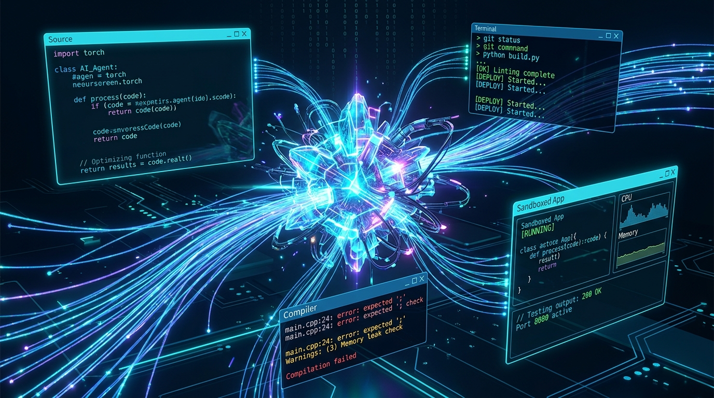
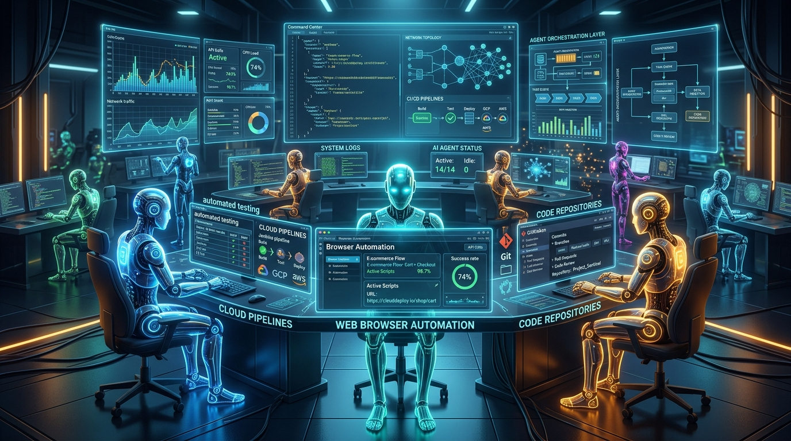

# Foreword: Escaping the Gravity Well

For over seven decades, software engineering has been constrained by a relentless cognitive gravity. Every line of code written demanded an equal measure of mental overhead: managing dependencies, tracking mutable state across distributed architectures, parsing opaque compiler diagnostics, and wrestling with framework lifecycle churn. As codebases scaled from tens of thousands of lines into multi-million-line monorepos, developer productivity became anchored to the floor.

When Large Language Models (LLMs) first arrived in the developer toolkit, initial implementations simply dropped autocomplete boxes into forty-year-old text editor paradigms. They were delightful novelties, but they did not solve the fundamental crisis: **software engineering is not typing; it is reasoning, planning, executing, and verifying.**

**Google Antigravity (AGY)** represents the escape velocity. Antigravity treats artificial intelligence not as an assistant that guesses your next twenty keystrokes, but as a **peer engineer** equipped with a sandboxed terminal, code navigation ASTs, headless browser automation, and strict security governance.

This expanded edition is designed as the ultimate engineering manual. It breaks down the exact architectural differences between the **CLI**, the **IDE**, the **2.0 Desktop Canvas**, and the **Python SDK**, presents battle-tested prompt blueprints, establishes the formal mathematics of goal definition, and charts the essential skill stack required for software engineers to thrive in the agentic era.

---

# Part I: The Ground Floor (Beginner)

## Chapter 1: The AI-First Awakening

### Beyond the Digital Typewriter

To understand Antigravity, you must first unlearn the traditional editor philosophy. The classical IDE—born in Smalltalk, refined by Eclipse, and popularized by Visual Studio Code—rests on a singular assumption: *a human engineer sits at a keyboard, manually edits buffer strings, and occasionally asks external programs (compilers, linters) to evaluate those strings.*

When AI was first introduced to this paradigm, it was relegated to the status of an advanced spellchecker. Copilot-style tools operated under strict token-completion constraints: given the cursor position in a document, predict the next few tokens.

This passive modality suffers from three fatal flaws:
1. **Zero Architectural Intention**: The autocomplete model does not know *why* you are writing the loop, only that the loop commonly follows the preceding variable assignment.
2. **Blindness to the Build Loop**: When an autocomplete tool inserts an import statement that does not exist in `package.json`, it cannot check the error, run `npm install`, or inspect the resulting diagnostic log.
3. **Cognitive Fatigue**: The human engineer spends more time reading and mentally debugging subtle AI hallucinations than they would have spent writing the code from scratch.



### The Architectural Triad of Antigravity

Antigravity re-architects the software development environment into three interconnected components:

> 🧠 **Core Architecture Concept: The Cognitive Engine**
> 
> Unlike standard conversational chatbots that respond in single back-and-forth turns, Antigravity executes an internal **Plan-Act-Observe Loop**. The model analyzes your codebase, formulates a multi-step execution tree, invokes filesystem and shell tools, observes the stdout/stderr return values, and self-corrects until its objective is verified.

1. **The Core Reasoning Runtime**: Backed by multimodal Gemini models with multi-million token context windows. It processes code, terminal logs, UI screenshots, and git trees simultaneously.
2. **The Execution Sandbox**: An isolated process environment where the agent can run shell commands (`make`, `cargo test`, `docker build`) without endangering your host OS or accessing unapproved networks.
3. **The Customization Engine**: A tiered system composed of **Rules**, **Skills**, **Hooks**, and **MCP Servers** that allow any repository to instill its own engineering culture into the agent.

### The Four Operational Surfaces: A Technical Comparison

A common point of confusion for engineers is deciding which Antigravity interface to use. Antigravity provides four distinct surfaces tailored to different stages of the development lifecycle:

| Surface | Form Factor | Execution Model | Memory Footprint | Primary Target Persona |
| :--- | :--- | :--- | :--- | :--- |
| **CLI (`agy`)** | Terminal TUI | Local Process / SSH | Light (< 50MB) | DevOps, SREs, Remote Sysadmins |
| **Antigravity IDE** | VS Code Fork | In-Editor Multi-modal | Moderate (~350MB) | Core Application Developers |
| **Antigravity 2.0** | Electron Desktop | Canvas / Multi-pane | Moderate (~400MB) | Tech Leads, Architects, Reviewers |
| **Python SDK** | Python Package | Programmatic Async Event Bus | Embedded | Automation & Platform Engineers |

---

## Chapter 2: First Contact: Setup, CLI & Configuration

### System Prerequisites & Installation

Antigravity runs natively on modern 64-bit platforms: Linux (x86_64 / ARM64), macOS (Apple Silicon / Intel), and Windows (via WSL2).

To install the Antigravity Command Line Interface (`agy`):

```bash
# Verify system environment
uname -m

# Install Antigravity CLI via standard package channel
curl -fsSL https://antigravity.google/install.sh | bash

# Verify installation
agy --version
```

### Authentication and Workspaces

On your first run of `agy`, the runtime initiates an OAuth device-authorization flow. A secure browser tab opens, allowing you to link your Google Cloud or Vertex AI developer identity.

Once authenticated, your runtime secrets and tokens are encrypted under:
- **Linux/macOS User Data**: `~/.gemini/antigravity-cli/`
- **Global Configuration**: `~/.gemini/config/`

```bash
# Launch interactive REPL in current directory
cd ~/projects/my-microservice
agy

# Or launch directly with an initial instruction
agy "Review open git diff and run unit tests"
```

### Mastering CLI Flags and Headless Scripting

The CLI provides powerful flags for scriptability and continuous integration:
- `agy -w /path/to/project`: Explicitly specifies the working workspace root.
- `agy --model gemini-3.8-pro`: Overrides the active reasoning model.
- `agy --sandbox=strict`: Forces all bash tools to run inside an ephemeral sandbox container.
- `agy --approval=never`: Runs the agent fully autonomously (ideal for headless CI/CD runners).
- `agy --format=json`: Emits machine-parseable JSON streams of tool calls and output events.

> 🛠️ **Engineering Lab Project 1: WeatherCraft - CLI Bootstrapping**
> 
> Let us walk through using `agy` in the terminal to initialize a full-stack project from scratch without writing boilerplate manually:
> ```bash
> # In your terminal
> mkdir weathercraft && cd weathercraft
> agy "Initialize a FastAPI backend and a Next.js 14 frontend in ./backend and ./frontend. Configure CORS between localhost:3000 and 8000, write a health check endpoint, and verify it with pytest."
> ```
> The agent will create the virtual environment, write `main.py`, set up `requirements.txt`, run `pip install`, generate `test_main.py`, and execute `pytest` inside the terminal sandbox to prove it works before returning control to you.

---

## Chapter 3: The Three Faces of Antigravity

Antigravity meets engineers across three complementary surfaces: the in-editor IDE, the standalone 2.0 Desktop canvas, and the terminal TUI.

### The Antigravity IDE: Three AI Modalities

Built on top of the open VS Code core, the Antigravity IDE integrates agentic capabilities directly into your editing canvas across three distinct interaction levels:

#### 1. Passive: Antigravity Tab (Autocomplete & Supercomplete)
Operating at the single-keystroke layer, Tab Autocomplete predicts your next intent:
- **Contextual Autocomplete**: Suggests tokens at the cursor based on adjacent open tabs, diagnostics, and recent terminal outputs.
- **Supercomplete**: Generates multi-line diffs (including deletions and structural refactors) rendered in floating preview overlays.
- **Tab-to-Jump**: Predicts where your cursor needs to navigate next (e.g., jumping from a function definition to its unit test assertion) and teleports your cursor with a single `<Tab>`.
- **Tab-to-Import**: Automatically resolves missing symbols and injects import statements at the top of the file.

#### 2. Instructive: Inline Command (`Ctrl+I` / `Cmd+I`)
When you want targeted changes without switching focus to a chat window:
1. Highlight a block of code (e.g., a messy SQL query or an unoptimized regex).
2. Press `Ctrl+I` (or `Cmd+I` on macOS).
3. Type: *"Refactor this into parameterized sqlx query with error logging"*.
4. Review the localized red/green diff right in your editor buffer and press `Enter` to accept.

#### 3. Collaborative: Sidebar Chat & Full Agent Mode
When a task spans across files, requires terminal execution, or needs architectural deliberation, press `Ctrl+Shift+L` to engage the Sidebar Agent. The agent can read files, write new modules, execute `npm test`, diagnose failures, and consult online documentation.

### Antigravity 2.0: The Desktop Command Center

Antigravity 2.0 is a standalone Electron desktop application tailored for high-autonomy multi-agent orchestration:
- **Left-Hand Sidebar**: Manage multiple project workspaces, active background cron schedules, installed skills, and global security policies.
- **Chat Canvas**: Supports deep markdown artifacts, interactive review modals, and media uploads.
- **Auxiliary Telemetry Pane**: A multi-tab inspector showing live Subagent swarms, running background daemon logs, generated Artifact documents, and attached terminal sessions.

> 💡 **Pro Tip: When to use which surface?**
> 
> - Use the **IDE** when you are actively writing code, navigating files, and need inline diffs and autocomplete.
> - Use the **CLI (`agy`)** when logged into remote cloud VMs, managing servers over SSH, or chaining shell pipes.
> - Use the **Desktop 2.0 Canvas** when conducting architectural redesigns, planning complex initiatives, or monitoring multiple background subagents.
> - Use the **Python SDK** when embedding agent intelligence into CI/CD pipelines, Slack bots, or automated test runners.

---

# Part II: Core Agentic Workflows & Pair Programming (Intermediate)

## Chapter 4: The Art of Planning, Goal Architecture & Review Loops

### Why Unplanned Agents Fail

The most common rookie mistake with AI coding assistants is issuing massive, ambiguous prompts:

> *"Rewrite my monolithic express app to clean architecture with TypeScript and add Docker."*

An unplanned agent immediately begins modifying files. By step 14, it has broken TypeScript compilation. By step 25, it is deleting code to silence compiler errors. By step 40, your git working tree is ruined.

Antigravity solves this with formal **Planning Mode**.

> 💡 **Pro Tip: The Planning Golden Rule**
> 
> Never let an agent touch code on a multi-file task until it has produced a formal `implementation_plan.md` artifact and received your explicit sign-off.

### The Anatomy of Planning Mode

When confronted with architectural tasks, Antigravity enters Planning Mode:
1. **Discovery & Research**: The agent searches the project using read-only tools (`grep_search`, `view_file`, `list_dir`). It inspects configuration files, existing test conventions, and database schemas.
2. **Implementation Plan Artifact**: The agent drafts a comprehensive technical plan at `brain/<id>/implementation_plan.md`.
3. **User Review Gate**: The agent halts execution and presents an interactive review card. You can request changes or approve the plan with a click.
4. **Execution & Verification**: Once approved, the agent executes edits incrementally, running build commands at each stage.
5. **Walkthrough Artifact**: Upon completion, the agent creates `walkthrough.md`, documenting every change made and providing proof of verification tests.

### The Anatomy of an Unbreakable Goal Definition

When running agents autonomously using the `/goal` command, the primary cause of runaway compute or degradation is **unbounded goal ambiguity**. If an agent does not have a mathematically deterministic stopping condition, it will hallucinate micro-optimizations indefinitely.

To prevent this, production Antigravity engineers use the **ATDG Framework (Acceptance Test-Driven Goal)**:

> 🧠 **Core Architecture Concept: The Four Pillars of an ATDG Goal**
> 
> Every autonomous goal statement must define:
> 1. **The Invariant**: What existing behavior or contract must NOT change under any circumstance.
> 2. **The Blast Radius**: The exact subdirectories or files that are mutable (everything else is read-only).
> 3. **The Deterministic Oracle**: The exact terminal command that evaluates success (must return exit code 0).
> 4. **The Stopping Rule**: The explicit condition under which the agent must stop and declare victory.

#### Vague Goal vs. Production-Grade ATDG Goal

* **Vague Goal (Fails 80% of the time)**:
  ```
  /goal Fix the broken checkout tests and make sure the API is robust.
  ```

* **ATDG Production Goal (Succeeds 99% of the time)**:
  ```
  /goal Invariant: Do NOT modify existing database schemas in prisma/schema.prisma or change the public response payload of POST /api/checkout.
  Scope: You are only permitted to edit files under src/services/checkout/ and src/utils/pricing.ts.
  Oracle: Run 'npm test test/checkout.spec.ts'.
  Termination: When all 14 tests pass with exit code 0 and 'npm run lint' yields zero errors, stop and generate walkthrough.md.
  ```

### The `/grill-me` Protocol

If you know *what* feature you want but haven't settled on the edge cases, invoke the `/grill-me` slash command. 

Instead of jumping into code, Antigravity assumes the role of a meticulous Principal Architect:
- *"How should we handle database connection timeouts during token refresh?"*
- *"Should we invalidate all active user sessions upon password reset, or only the current device?"*
- *"Do you want this API endpoint to be rate-limited by IP or by authenticated user ID?"*

Only once all design ambiguities are resolved does it formulate the plan.

> 🛠️ **Engineering Lab Project 2: AuthSentinel - Refactoring Legacy Auth in Planning Mode**
> 
> In this project, we refactor an insecure session-cookie service into an audited JWT architecture with rotating refresh tokens stored in Redis:
> 1. Open the project in Antigravity IDE and type `/grill-me` in Sidebar Chat: *"Refactor auth from memory sessions to Redis JWT with refresh token rotation."*
> 2. The agent interviews you on secret rotation windows and cookie security flags (`HttpOnly`, `SameSite=Strict`).
> 3. The agent generates `implementation_plan.md` outlining the exact modifications across `auth.service.ts`, `redis.client.ts`, and `auth.guard.ts`.
> 4. You review and approve the plan. The agent updates dependencies via `npm install`, writes the files, and launches `npm test` to verify that all 18 security regression tests pass.

---

## Chapter 5: Precision Context Engineering & Battle-Tested Prompts

### The Context Economy

Modern LLMs boast massive context windows, but context is not free:
1. **Latency**: Processing a 500,000-token prompt takes noticeably longer than a targeted 10,000-token prompt.
2. **Attention Dilution**: When irrelevant files clutter the context window, the model's ability to notice critical subtleties in core logic degrades.

### The Power of `@` Mentions

Antigravity gives you surgical control over context using the `@` mention system:

| Mention Syntax | Resolved Context Injected |
| :--- | :--- |
| `@file:src/auth.ts` | Injects the full text of `src/auth.ts` into the turn. |
| `@folder:src/controllers/` | Injects directory listing and file summaries for that folder. |
| `@symbol:UserService` | Locates and injects the AST definition of the class or interface. |
| `@commit:HEAD~1` | Injects the git diff and commit log of the specified revision. |
| `@transcript:0e58b2` | Injects key context from an earlier conversation session. |
| `@mcp:github/search_issues` | Injects schema and tool instructions for an MCP tool. |

### The Production Prompt Engineering Taxonomy

Prompting an autonomous agent is fundamentally different from prompting a conversational chatbot. An agent executes real tools. Below are battle-tested production prompt patterns:

#### 1. The Zero-Regression Refactoring Blueprint
When refactoring critical business logic, you must forbid interface breakage and speculative deletions:

```
You are refactoring @file:src/services/billing.py to use async/await with httpx instead of requests.
Strict Invariants:
1. Preserve all public method signatures, argument names, and return type hints.
2. Preserve all existing docstrings and inline business comments.
3. Do NOT delete existing helper methods; mark them @deprecated if replaced.
4. Run 'pytest tests/test_billing.py' before and after edits. All 22 tests must remain green.
```

#### 2. The Forensic Bug Triage Blueprint
When diagnosing production errors, force the agent to reproduce the bug with a test *before* writing a fix:

```
Investigate error log @file:logs/sentry_event_9402.json.
Follow this mandatory 3-step triage loop:
Step 1 (Reproduction): Write a reproduction unit test in tests/repro_bug_9402.py that asserts the expected behavior and currently FAILS. Run pytest to demonstrate the failure.
Step 2 (Root-Cause Isolation): Inspect @symbol:calculate_rebate and explain the exact mathematical flaw.
Step 3 (Remediation): Implement the minimal fix in src/rebate.py. Verify that tests/repro_bug_9402.py now passes and no existing tests regress.
```

#### 3. Negative Constraints Formulation
Negative constraints prevent common LLM degradation behaviors:
- **Anti-Mocking**: *"Do NOT mock the database in integration tests; use the local testcontainers Postgres instance."*
- **Anti-Stubbing**: *"Never leave `// TODO: implement later` stubs or placeholder functions. Every branch must be fully implemented."*
- **Scope Jail**: *"Do NOT create files outside `src/features/search/`. Do NOT modify `package.json` without asking."*

> ⚔️ **War Story from the Trenches: The Million-Token Hallucination Trap**
> 
> A development team once attached their entire 2GB `node_modules` folder to an agent prompt via a misplaced wildcard. The agent spent 12 minutes digesting 800,000 tokens of minified JavaScript, completely missed the two-line syntax bug in the user's controller, and timed out. By switching to `@symbol:UserController` and `@file:src/routes.ts`, the context dropped to 1,400 tokens, and the bug was fixed in 4 seconds.

---

## Chapter 6: The Iron Sandbox: Security & Permissions

> ⚠️ **Caution & Security Warning: The Threat Model of Autonomous Agents**
> 
> An agent capable of executing terminal commands can accidentally run `rm -rf /`, leak environment secrets to public pastebins, or download malicious dependencies. Security must be enforced at the runtime level, not left to model obedience.

### Execution Policies

Antigravity enforces configurable permission levels:
- **`strict`**: The agent must request interactive user approval before running any command, reading unapproved files, or touching the network.
- **`request-review`**: Read operations proceed automatically; write operations and shell commands require user approval.
- **`proceed-in-sandbox`**: The agent executes commands freely, but strictly inside an unprivileged Linux container sandbox with isolated namespaces.
- **`always-proceed`**: Zero confirmation prompts. Intended exclusively for isolated VM sandboxes or test runners.

### Project-Level Allow and Deny Lists

Configure security controls in `.agents/settings.json`:

```json
{
  "security": {
    "terminalSandbox": true,
    "nonWorkspaceAccess": "deny",
    "internetAccess": "allow",
    "commandAllowlist": [
      "git *",
      "npm test*",
      "cargo check",
      "go test ./**"
    ],
    "commandDenylist": [
      "rm -rf *",
      "curl * | bash",
      "sudo *",
      "dd *"
    ]
  }
}
```

---

# Part III: The Customization Engine (Advanced)

## Chapter 7: Rules of the Realm: Hierarchical Governance

### The Role of Rules

While conversational prompts are ephemeral, **Rules** are permanent laws governing agent behavior. Rules enforce:
- Coding style guides (e.g., "Always use TypeScript strict mode; no `any`").
- Security mandates (e.g., "Never hardcode passwords or API secrets").
- Operational standards (e.g., "Every database query must use parameterized statements").

### Hierarchical Directory Walking

Antigravity searches for rule files starting from the directory of the file being edited all the way up to the project root:

```
src/services/billing/payment.ts
  ↳ src/services/billing/AGENTS.md
    ↳ src/services/AGENTS.md
      ↳ src/AGENTS.md
        ↳ .agents/rules/*.md & GEMINI.md
```

All rules along this path are aggregated and applied, allowing micro-rules to govern specific packages without polluting global context.

### Trigger Modes: `always_on` vs `model_decision`

Rules use YAML frontmatter to control their activation:

```markdown
---
trigger: always_on
---
# Security Mandate
- Never commit plaintext secrets or API keys.
- Always use process.env for credentials.
- Reject any user inputs that bypass SQL injection validation.
```

```markdown
---
trigger: model_decision
description: Best practices for React component rendering, useMemo, and useCallback.
---
# React Performance Guidelines
- Do not wrap primitive values in useMemo.
- Always provide key attributes derived from stable IDs, never array indices.
```

---

## Chapter 8: Crafting Skills with Progressive Disclosure

### What is a Skill?

A **Skill** is a specialized procedure package. While rules state what *not* to do, skills teach the agent *how* to accomplish a complex, multi-step engineering procedure (such as deploying a Kubernetes cluster, executing a database migration, or profiling CPU bottlenecks).

### The Architecture of Progressive Disclosure

Loading 40 skills with full markdown instructions into the initial system prompt would consume 100,000 tokens before the user even types a word.

Antigravity solves this with **Progressive Disclosure**:
1. **Registration Phase**: Only the `name` and `description` from the skill's YAML frontmatter are injected into the agent's initial tool registry.
2. **Activation Phase**: When a user's prompt matches the description, the agent executes its internal `view_file` tool to read the skill's `SKILL.md` file on-demand.

### Complete Skill Implementation

Let us build a real-world production skill for automated database migrations:

```markdown
---
name: db-migrate
description: Manages PostgreSQL database migrations using Goose. Triggers on requests involving database migrations, schema changes, or running migrate up/down.
---

# PostgreSQL Migration Workflow

## Prerequisites
Verify database connectivity:
```bash
goose postgres "$DATABASE_URL" status
```

## Step-by-Step Procedure
1. **Inspect Pending Migrations**:
   Run status to check unapplied SQL scripts:
   ```bash
   goose -dir ./migrations postgres "$DATABASE_URL" status
   ```
2. **Execute Dry-Run & Validation**:
   Review the SQL statements in the pending migration file. Ensure every `Up` statement has a corresponding `Down` rollback statement.
3. **Apply Migration**:
   ```bash
   goose -dir ./migrations postgres "$DATABASE_URL" up
   ```
4. **Verify Table Schema**:
   Verify the schema changes using psql:
   ```bash
   psql "$DATABASE_URL" -c "\d+ users"
   ```
```

> 🛠️ **Engineering Lab Project 3: CloudScale - Authoring Enterprise Skills and MCP**
> 
> In this project, we package an internal release automation skill that validates container images against Trivy vulnerability scanners, deploys to staging via Helm, runs integration smoke tests, and updates the Jira release ticket via MCP tools.

---

## Chapter 9: Deterministic Gates with Hooks

> 🧠 **Core Architecture Concept: Probabilistic vs. Deterministic Guardrails**
> 
> A prompt or rule is *probabilistic*: the LLM tries to follow it, but there is always a non-zero chance of a mistake. A **Hook** is *deterministic*: it is a shell script executed by the operating system before or after a tool call. If the hook fails, the action is stopped dead in its tracks.

### Configuring `hooks.json`

Hooks are configured in `.agents/hooks.json`:

```json
{
  "hooks": {
    "pre_tool_use": [
      {
        "matcher": { "tool": "run_command" },
        "command": "python3 .agents/hooks/enforce_branch_protection.py",
        "blocking": true,
        "timeoutMs": 5000
      }
    ],
    "post_tool_use": [
      {
        "matcher": { "tool": "replace_file_content" },
        "command": "npx prettier --write \"$ANTIGRAVITY_MODIFIED_FILE\"",
        "blocking": false
      }
    ]
  }
}
```

### Writing a Blocking Pre-Tool Validation Hook

Here is a Python script that prevents the agent from running destructive Git commands on protected branches:

```python
import os
import sys
import subprocess

# Read tool invocation details from environment
command_to_run = os.environ.get("ANTIGRAVITY_COMMAND_LINE", "")

# Check current git branch
branch = subprocess.check_output(
    ["git", "rev-parse", "--abbrev-ref", "HEAD"], 
    text=True
).strip()

if branch in ["main", "master", "production"]:
    if "push" in command_to_run or "reset --hard" in command_to_run:
        sys.stderr.write(
            f"ERROR: Destructive command blocked on protected branch '{branch}'!\n"
        )
        sys.exit(1) # Non-zero exit code halts tool execution

sys.exit(0)
```

---

## Chapter 10: Model Context Protocol (MCP) Integration

### What is MCP?

The **Model Context Protocol (MCP)** is an open, standardized protocol created to connect AI agents with external data stores, SaaS APIs, and custom tooling over JSON-RPC (via standard I/O or SSE).

Through MCP, Antigravity can directly:
- Query production SQL databases.
- Inspect and review GitHub Pull Requests and Issues.
- Fetch CloudWatch or Datadog telemetry logs.
- Trigger AWS Lambda or Google Cloud Run deployments.

### Configuring `mcp_config.json`

Add server definitions to `.agents/mcp_config.json`:

```json
{
  "mcpServers": {
    "github": {
      "command": "npx",
      "args": ["-y", "@modelcontextprotocol/server-github"],
      "env": {
        "GITHUB_PERSONAL_ACCESS_TOKEN": "ghp_secureToken12345"
      }
    },
    "production_postgres": {
      "command": "docker",
      "args": [
        "run", "-i", "--rm",
        "-e", "DATABASE_URL=postgres://readonly@db.internal:5432/prod",
        "mcp/postgres"
      ]
    }
  }
}
```

### Lazy vs. Eager Tool Loading

Connecting 10 MCP servers could easily register 300+ tools. If all 300 tool definitions were injected into the system prompt, context overhead would be immense.

Antigravity handles this by classifying MCP tools as **Lazy Loaded**:
- The agent is provided a meta-tool: `call_mcp_tool(server, tool, args)`.
- It reads the tool's JSON schema only when it decides to call it, keeping the primary prompt lean.

---

# Part IV: Programmatic Agent Mastery & The Skill Stack (Expert)

## Chapter 11: The Antigravity Python SDK

### Headless Agent Orchestration

While the IDE and CLI cater to humans sitting at keyboards, the modern enterprise requires **headless agent pipelines**: automated PR reviewers, nightly security patchers, and autonomous triage bots.

Google provides the official Python SDK:

```bash
pip install google-antigravity
```



### Building an Asynchronous SRE Agent

Below is a complete, production-ready Python script using the SDK:

```python
import asyncio
import sys
from google.antigravity import (
    Agent, 
    LocalAgentConfig, 
    CapabilitiesConfig, 
    SecurityPolicy
)

async def run_diagnostics():
    # Configure the programmatic agent
    config = LocalAgentConfig(
        workspace_dir="/var/www/ecommerce-core",
        system_instructions=(
            "You are an expert Site Reliability Engineer. "
            "Inspect recent crash logs, locate the bug in source code, "
            "and create a pull request with unit test coverage."
        ),
        capabilities=CapabilitiesConfig(
            allow_file_modifications=True,
            allow_terminal_execution=True,
            allow_internet_access=True
        ),
        security_policy=SecurityPolicy(
            terminal_sandbox=True,
            non_workspace_access="deny"
        )
    )

    # Agent acts as an async context manager
    async with Agent(config) as agent:
        print("[+] Agent session established. Dispatching mission...")
        
        response = await agent.chat(
            "Diagnose 500 errors reported in /var/log/app.err.log"
        )

        # Stream internal chain-of-thought reasoning
        async for thought in response.thoughts:
            print(f"[THOUGHT] {thought}")

        # Intercept and log tool calls
        async for tool_call in response.tool_calls:
            print(f"[TOOL] Invoking {tool_call.name} with {tool_call.args}")

        # Stream final conversational tokens
        print("\n--- Final Agent Report ---")
        async for token in response:
            sys.stdout.write(token)
            sys.stdout.flush()
        print()

if __name__ == "__main__":
    asyncio.run(run_diagnostics())
```

### Deep Architectural Comparison: CLI vs. SDK

Understanding the boundary between `agy` and `google-antigravity`:
- **The CLI (`agy`)**: Designed for interactive human sessions or one-shot command lines. The output is rendered via a terminal UI (Rich/TUI). Error handling stops and asks the user for guidance.
- **The Python SDK**: Designed for programmatic integration into larger distributed systems. Yields strongly-typed async events (`ThoughtDelta`, `ToolCallEvent`, `StreamChunk`). Gives the host Python process complete programmatic control to intercept tool calls, inject synthetic results, or route tasks to worker queues.

---

## Chapter 12: Swarms, Browser Agents & Daemons

### Subagent Delegation (`invoke_subagent`)

When a task is too vast for a single context window, the primary agent can spawn specialized **Subagents**:
- **Context Isolation**: The subagent begins with a clean context, insulated from conversational noise in the main thread.
- **Specialized Personas**: Subagent A is spun up as a "Database Index Optimizer"; Subagent B is spun up as a "Frontend CSS Expert".
- **Return Value Consolidation**: When the subagent completes its task, it returns a concise summary back to the parent agent.

### Autonomous Browser Automation

Testing web applications requires seeing what the user sees. Antigravity includes a dedicated browser automation subagent:
1. Launches a headless Chromium instance.
2. Navigates to local development URLs (e.g., `http://localhost:3000`).
3. Types into form inputs, clicks buttons, and asserts DOM changes.
4. **Automatic WebP Video Recording**: Automatically captures a recording of the entire browser session and embeds it in the walkthrough artifact so you can visually verify the UI test.

### Background Daemons & The Scheduler

Rather than locking the terminal with `sleep 30`, Antigravity uses the `schedule` tool:
- **One-Shot Timers**: Fires a notification after $N$ seconds, waking up the agent reactively.
- **Recurring Cron Jobs**: Configured with standard 5-field cron syntax (`*/30 * * * *`) to run automated health checks or polling jobs.

> 🛠️ **Engineering Lab Project 4: AutoSRE Sentinel - Building a 24/7 Monitoring Agent**
> 
> We create a standalone Python daemon using the Antigravity SDK:
> 1. The script connects to an AWS SQS queue receiving alerts from Datadog.
> 2. When an anomaly is detected, it spins up an `Agent` instance scoped to the offending microservice repo.
> 3. The agent inspects recent git commits, reproduces the failure in a container sandbox, runs headless browser verification with video recording, commits a hotfix to a branch, and opens a GitHub Pull Request with the WebP video attached.

---

## Chapter 13: Enterprise Monorepos & CI/CD

### Scaling Antigravity in Large Repositories

In monorepos containing millions of lines of code, global rules become unwieldy. Follow the **Domain-Partitioned Pattern**:

```
monorepo-root/
|-- .agents/
|   |-- rules/
|   |   \-- global-security.md    # Applies across all services
|   \-- hooks.json
|-- services/
|   |-- payments/
|   |   |-- .agents/
|   |   |   \-- rules/
|   |   |       \-- pci-dss.md    # Strict financial compliance rules
|   |   \-- AGENTS.md
|   \-- search/
|       |-- .agents/
|       |   \-- rules/
|       |       \-- elastic.md    # Indexing guidelines
|       \-- AGENTS.md
```

### GitHub Actions CI/CD Integration

Run Antigravity as an automated pull-request review bot:

```yaml
name: Antigravity Autonomous PR Review
on:
  pull_request:
    types: [opened, synchronize]

jobs:
  agentic-review:
    runs-on: ubuntu-latest
    permissions:
      contents: write
      pull-requests: write
    steps:
      - name: Checkout Code
        uses: actions/checkout@v4
        with:
          fetch-depth: 0

      - name: Set up Python
        uses: actions/setup-python@v5
        with:
          python-version: '3.11'

      - name: Install Dependencies
        run: |
          pip install google-antigravity PyGithub

      - name: Run Antigravity Review Bot
        env:
          GEMINI_API_KEY: ${{ secrets.GEMINI_API_KEY }}
          GITHUB_TOKEN: ${{ secrets.GITHUB_TOKEN }}
        run: |
          python3 .agents/ci/review_pr.py
```

---

## Chapter 14: The AI Developer's Skill Stack: Thriving in the Agentic Era

### The Evolution: From Code Typist to Systems Director

With the advent of autonomous coding agents, the economic value of memorizing programming syntax, library APIs, and boilerplate patterns has plummeted toward zero. Conversely, the value of **architectural decomposition, rigorous verification design, and systems-level orchestration** has grown exponentially.

The engineer of the future is not a typist: they are an **Executive Director of AI Engineering Swarms**.

### The Six Core Pillars of AI Engineering

> 🧠 **Core Architecture Concept: The Six Pillars of the Modern AI Engineer**
> 
> To operate Antigravity at enterprise scale, engineers must develop mastery across six core dimensions:
> 1. **Test Harness Architecture (The Oracle Problem)**: Constructing deterministic, fast, automated test suites that serve as the ground truth for agent verification.
> 2. **Attention & Context Curation**: Designing lean context boundaries, navigating AST symbol graphs, and eliminating prompt noise.
> 3. **Governance Stratification**: Intuitively knowing whether an instruction belongs in a conversational prompt, a hierarchical rule, a progressive skill, or a deterministic hook.
> 4. **Defensive Sandboxing & Blast Radius Isolation**: Hardening execution environments, establishing read/write jails, and restricting network capabilities.
> 5. **Agent Observability & Log Forensics**: Analyzing chain-of-thought streams, parsing agent transcripts, and diagnosing tool execution faults.
> 6. **Deconstructive Systems Decomposition**: Breaking complex product features into modular sub-tasks that can be leased to specialized subagents.

#### 1. Solving the Oracle Problem
An AI agent can only generate code as good as the test suite that evaluates it. If your codebase has no tests, an agent operating under `/goal` will consider its job done as soon as the syntax compiles—regardless of whether business logic is broken. AI engineers spend 60% of their effort designing bulletproof test harnesses and property-based tests that act as objective truth oracles.

#### 2. The Tri-Layer Governance Stratum
When establishing repository standards, use the following decision matrix:
- **Use Prompts**: For ephemeral, one-time instructions specific to the immediate task.
- **Use Rules (`.agents/rules/`)**: For universal coding style, lint standards, and architectural conventions that must apply across multiple turns.
- **Use Skills (`.agents/skills/`)**: For complex multi-step procedures (runbooks, deployments, migrations) loaded on-demand via progressive disclosure.
- **Use Hooks (`hooks.json`)**: For non-negotiable security gates (e.g., blocking commits to main, scanning secrets) that must NEVER be bypassed by LLM hallucination.

---

## Chapter 15: Interfacing Antigravity: WhatsApp, Telegram & Google Workspace

### The Omnichannel Agent Architecture

In modern engineering teams, problems do not wait for developers to open an IDE. Critical deployment failures happen during off-hours, executive queries require instant telemetry summaries, and on-call engineers triage alerts on mobile devices.

To meet engineers wherever they are, Antigravity supports an **Omnichannel Gateway Architecture**:

```
[WhatsApp / Telegram] ⟷ [Gateway Controller (FastAPI)] ⟷ [Antigravity Python SDK] ⟷ [Google Sheets / Gmail / Repositories]
```

> 🧠 **Core Architecture Concept: The Gateway Decoupling Pattern**
> 
> Never connect conversational chat apps directly to raw bash toolkits without a mediating gateway. The Gateway Controller:
> 1. **Maps User Identities**: Resolves a Telegram `chat_id` or WhatsApp phone number to authorized repository permissions.
> 2. **Buffers Async Streaming**: Aggregates agent token deltas into conversational messages and handles Telegram/WhatsApp rate limits.
> 3. **Dispatches Artifacts**: Converts generated markdown reports, diff patches, or test videos into native mobile attachments.

### WhatsApp Cloud API Integration Workflow

The Meta WhatsApp Business Cloud API operates over webhooks. Below is the complete production workflow for an autonomous Antigravity WhatsApp bot:

#### 1. End-to-End Flow:
1. **Inbound Message**: An engineer sends on WhatsApp: *"Run smoke tests on staging and post incident log to Sheets"*.
2. **Webhook Receiver**: A lightweight FastAPI server validates the Meta verification challenge and HMAC signature.
3. **Agent Execution**: The Antigravity Python SDK spins up an isolated `Agent` session and executes the test harness.
4. **WhatsApp Response**: Formatted status, log summaries, and diffs are delivered back to the WhatsApp conversation thread.

#### 2. Production WhatsApp Gateway Server (FastAPI):
```python
import os
import httpx
from fastapi import FastAPI, Request, Query, Response
from google.antigravity import Agent, LocalAgentConfig, CapabilitiesConfig

app = FastAPI()

WHATSAPP_TOKEN = os.environ["WHATSAPP_API_TOKEN"]
PHONE_NUMBER_ID = os.environ["WHATSAPP_PHONE_ID"]
VERIFY_TOKEN = os.environ["WHATSAPP_VERIFY_TOKEN"]

# 1. Verification Challenge (Meta Setup)
@app.get("/webhook")
async def verify_webhook(
    mode: str = Query(..., alias="hub.mode"),
    token: str = Query(..., alias="hub.verify_token"),
    challenge: str = Query(..., alias="hub.challenge")
):
    if mode == "subscribe" and token == VERIFY_TOKEN:
        return Response(content=challenge, media_type="text/plain")
    return Response(status_code=403)

# 2. Inbound Message Handler
@app.post("/webhook")
async def handle_whatsapp_message(request: Request):
    payload = await request.json()
    try:
        entry = payload["entry"][0]["changes"][0]["value"]
        messages = entry.get("messages", [])
        if not messages:
            return {"status": "ignored"}

        user_msg = messages[0]["text"]["body"]
        sender_phone = messages[0]["from"]

        # 3. Dispatch to Antigravity Agent
        config = LocalAgentConfig(
            workspace_dir="/var/www/ecommerce-api",
            capabilities=CapabilitiesConfig(allow_terminal_execution=True)
        )
        async with Agent(config) as agent:
            response = await agent.chat(user_msg)
            full_text = ""
            async for token in response:
                full_text += token

        # 4. Reply via WhatsApp Graph API
        url = f"https://graph.facebook.com/v20.0/{PHONE_NUMBER_ID}/messages"
        headers = {"Authorization": f"Bearer {WHATSAPP_TOKEN}"}
        body = {
            "messaging_product": "whatsapp",
            "to": sender_phone,
            "type": "text",
            "text": {"body": full_text[:4096]}
        }
        async with httpx.AsyncClient() as client:
            await client.post(url, json=body, headers=headers)

    except Exception as e:
        print(f"Error handling webhook: {e}")
    return {"status": "ok"}
```

### Telegram Bot Integration Workflow

Telegram provides superior support for long messages, markdown formatting, document uploads, and dynamic message editing.

#### Real-Time Thinking Stream over Telegram:
Using the `response.thoughts` stream from the Antigravity Python SDK, we can update a Telegram message in real-time as the agent reasons:

```python
import os
import asyncio
from telegram import Update
from telegram.ext import Application, MessageHandler, filters, ContextTypes
from google.antigravity import Agent, LocalAgentConfig, CapabilitiesConfig

TELEGRAM_BOT_TOKEN = os.environ["TELEGRAM_BOT_TOKEN"]

async def handle_message(update: Update, context: ContextTypes.DEFAULT_TYPE):
    user_prompt = update.message.text
    status_msg = await update.message.reply_text("Thinking...")

    config = LocalAgentConfig(
        workspace_dir="/home/dev/microservices/payment-hub",
        capabilities=CapabilitiesConfig(allow_file_modifications=True, allow_terminal_execution=True)
    )

    async with Agent(config) as agent:
        response = await agent.chat(user_prompt)

        # Stream thoughts to Telegram
        thought_accumulator = ""
        last_edit_time = asyncio.get_event_loop().time()

        async for thought in response.thoughts:
            thought_accumulator += thought
            now = asyncio.get_event_loop().time()
            # Throttle Telegram edits to prevent rate limits (max 1 edit / 1.5s)
            if now - last_edit_time > 1.5:
                preview = thought_accumulator[-200:].strip()
                await status_msg.edit_text(f"Working...\n\nThought: _{preview}_", parse_mode="Markdown")
                last_edit_time = now

        # Stream and accumulate final answer
        final_answer = ""
        async for token in response:
            final_answer += token

        # Deliver final message
        await status_msg.edit_text(final_answer[:4000])

def main():
    app = Application.builder().token(TELEGRAM_BOT_TOKEN).build()
    app.add_handler(MessageHandler(filters.TEXT & ~filters.COMMAND, handle_message))
    print("[*] Antigravity Telegram Bot polling...")
    app.run_polling()

if __name__ == "__main__":
    main()
```

### Google Workspace Integration (Sheets & Gmail via MCP)

Antigravity seamlessly interacts with Google Sheets and Gmail through the **Model Context Protocol (MCP)** or direct Google API integrations.

#### 1. Google Sheets as an Autonomous Audit Ledger
Configure the Google Sheets MCP server in `.agents/mcp_config.json`:

```json
{
  "mcpServers": {
    "google_sheets": {
      "command": "npx",
      "args": ["-y", "@modelcontextprotocol/server-google-sheets"],
      "env": {
        "GOOGLE_SERVICE_ACCOUNT_KEY_PATH": "/secrets/google_service_account.json"
      }
    },
    "gmail": {
      "command": "npx",
      "args": ["-y", "@modelcontextprotocol/server-gmail"],
      "env": {
        "GMAIL_CREDENTIALS_PATH": "/secrets/gmail_oauth.json"
      }
    }
  }
}
```

#### 2. Cross-Platform Orchestration Prompt Example:
```
Investigate failing payment webhook in @file:logs/webhook_errors.log.
1. Fix the bug in src/webhooks/stripe.ts and verify with 'npm test'.
2. Append a new audit row to Google Sheet 'Production Incident Log' with timestamp, error summary, file changed, and author.
3. Draft an email in Gmail to 'engineering-leads@company.com' with subject '[INCIDENT RESOLVED] Stripe Webhook Fix' detailing the root cause and PR link.
```

> 🛠️ **Engineering Lab Project 5: The Omnichannel SRE Concierge**
> 
> An on-call engineer receives an alert on **WhatsApp** while commuting. They reply: *"@antigravity investigate high CPU on order service and post incident summary to Sheets"*.
> 1. The WhatsApp Gateway routes the prompt to the Antigravity agent.
> 2. The agent inspects container stats, identifies a runaway regex in `validator.py`, writes an optimized replacement, and runs the test suite.
> 3. The agent appends a structured log row to the shared team **Google Sheet**.
> 4. The agent drafts a post-mortem email in **Gmail** for the team.
> 5. The agent sends a **Telegram** message to the team channel with the git diff and sends a confirmation to the engineer on **WhatsApp** with the resolution status.

---

# Appendices

## Appendix A: Slash Command Quick Reference

| Command | Mode | Description |
| :--- | :--- | :--- |
| `/help` | All | Displays active tools, model configuration, and keybindings. |
| `/goal` | Autonomous | Locks the agent into self-verifying persistence mode until tests pass. |
| `/grill-me` | Planning | Launches an architectural interview to extract missing requirements. |
| `/learn` | Customization | Distills session insights into permanent workspace rules in `.agents/rules/`. |
| `/schedule` | Background | Configures delayed timers or recurring background cron jobs. |
| `/clear` | Context | Resets conversation history while retaining active workspace rules. |
| `/exit` | CLI | Gracefully terminates the session (`Ctrl+D Ctrl+D`). |

---

## Appendix B: Customization Directory Reference

| File / Path | Function & Precedence |
| :--- | :--- |
| `.agents/rules/*.md` | Project-level rules. Highest precedence. |
| `GEMINI.md` / `AGENTS.md` | Hierarchical directory rule files discovered during path walking. |
| `.agents/skills/<name>/SKILL.md` | Project skills. Loaded on-demand via progressive disclosure. |
| `.agents/hooks.json` | Deterministic pre/post tool execution hooks. |
| `.agents/mcp_config.json` | Project-level Model Context Protocol server configurations. |
| `~/.gemini/config/` | Global user configuration root (machine-wide fallback). |
| `~/.gemini/antigravity-ide/` | IDE application state, artifacts cache, and transcripts. |

---

## Appendix C: Keyboard Shortcuts Cheat Sheet

| Action | Antigravity IDE | Antigravity CLI (agy) |
| :--- | :--- | :--- |
| Accept Autocomplete | `<Tab>` | N/A |
| Trigger Inline Edit | `Ctrl+I` / `Cmd+I` | N/A |
| Open Chat Panel | `Ctrl+Shift+L` | Native TUI Canvas |
| Mention Context | `@` | `@` |
| Slash Commands | `/` | `/` |
| Cancel Execution | `Escape` | `Ctrl+C` |
| Exit Session | Close Window | `Ctrl+D Ctrl+D` |

---

## Appendix D: Production Prompt & Goal Cookbook

### Cookbook 1: Zero-Downtime Database Column Migration
```
/goal Objective: Add a new 'email_verified_at' TIMESTAMP column to the 'users' table without locking the production database.
Scope: Edits allowed only in db/migrations/ and src/models/user.ts.
Invariants:
1. Migration must be split into: (1) Add column as nullable, (2) Backfill script, (3) Model updates.
2. Provide both UP and DOWN SQL files.
Oracle: Execute 'npm run db:migrate:test' and 'npm test test/models/user.spec.ts'. All tests must pass.
```

### Cookbook 2: Performance Profiling & Optimization
```
Profile endpoint GET /api/v1/analytics/dashboard.
1. Run benchmarks with 'k6 run benchmarks/dashboard.js' and record P95 latency and memory usage.
2. Inspect @file:src/services/dashboard.service.ts for N+1 SQL queries or unindexed scans.
3. Optimize queries using DataLoader or Redis caching.
4. Re-run k6 benchmark. Optimization is successful only if P95 latency drops by >40% and zero existing tests fail.
```

### Cookbook 3: Hardened API Endpoint Greenfield Scaffold
```
Scaffold a new endpoint: POST /api/v1/payments/refund.
1. Strict Validation: Use Zod schema to validate refund amount > 0, currency ISO 4217, and uuid v4 transaction_id.
2. Idempotency: Implement Redis idempotency key lock with 60s TTL.
3. Architecture: Split into handler (src/api/refund.ts), service (src/services/refund.service.ts), and audit log event.
4. Tests: Write unit tests in test/refund.spec.ts covering (a) success, (b) duplicate idempotency replay, (c) insufficient funds error.
Oracle: Run 'npm test test/refund.spec.ts'. All tests must pass.
```
